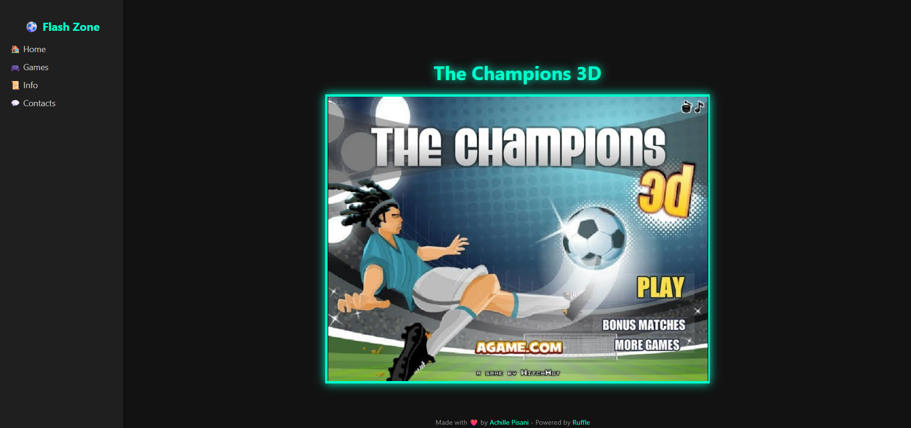

# RescueFlash
I was with a friend and we discovered that most of the Flash games we used to play as kids have been unsupported by browsers for several years.  
So I decided to do some research and write a page capable of running all those games, based on a soccer game I'd already assumed was Lost Media.  
So, welcome to...  

# ⚽ The Champions 3D - Flash Revival Edition

Welcome to the modern version of **The Champions 3**, the iconic Flash football game now fully playable thanks to [Ruffle](https://ruffle.rs/), a safe and open-source emulator for `.swf` content.

> ✅ No Adobe Flash Player required  
> ✅ Works on all modern browsers  
> ✅ Beautiful dark-themed interface with custom CSS, game at the center

> ## 🚀 How to Run the Game

 ### 1. 📥 Download [Ruffle](https://ruffle.rs) (if you download this entire repository this step is already done) 
   - we need the self-hosted version
   - we need to extract the content of the zip into a ruffle/ subfolder next to our HTML page

### 2. 🗂 Place the `.swf` Game File (if you download this entire repository this step is already done)
  - it has to be put in the same directory of the HTML

### 3. 🌐 Launch the app
#### There are TWO WAYS:
##### 1️⃣ Just by opening the index.html (not recommended)
  - I tried this method a few times but with many games (The Champions 3D included) it doesen't work.
##### 2️⃣ Launch via local server (I'm doing this using Python):
  - Go to the "index.html"'s folder with your terminal
  - send the following command if you're using Windows:
```bash
    py -m http.server 8000
 ```
  - or if you've Python 3.x:
```bash
   python3 -m http.server 8000
 ```
- Open your browser and go to:
    ```bash
   http://localhost:8000
    ```

    ##### I put in the repository two easy Python scripts for turning on and off the server (start_server.py AND stop_server.py)
  (stop_server stops the server only if it's in background).

*🔄 An alternative to the python script could be VS Code + Live Server*

### 🧠 Features:
💡 Modern interface with dark mode and neon effects  
🎮 Flash game centered and responsive  
🎨 Fully customizable external CSS  
🧱 Sidebar navigation (not already fully working)  
⚙️ I tried this on Chrome and Edge, it should work on all the browsers because it doesn't need flash.  




## ❤️ Credits
- Original game: The Champions 3D (by Mousebreaker / Miniclip)
- Flash emulator: Ruffle.rs
- Frontend development: Achille Pisani

## ⚠️ Legal Notice
- This project is a personal and educational revival of a legacy Flash game.
- All copyrights belong to their original authors.
